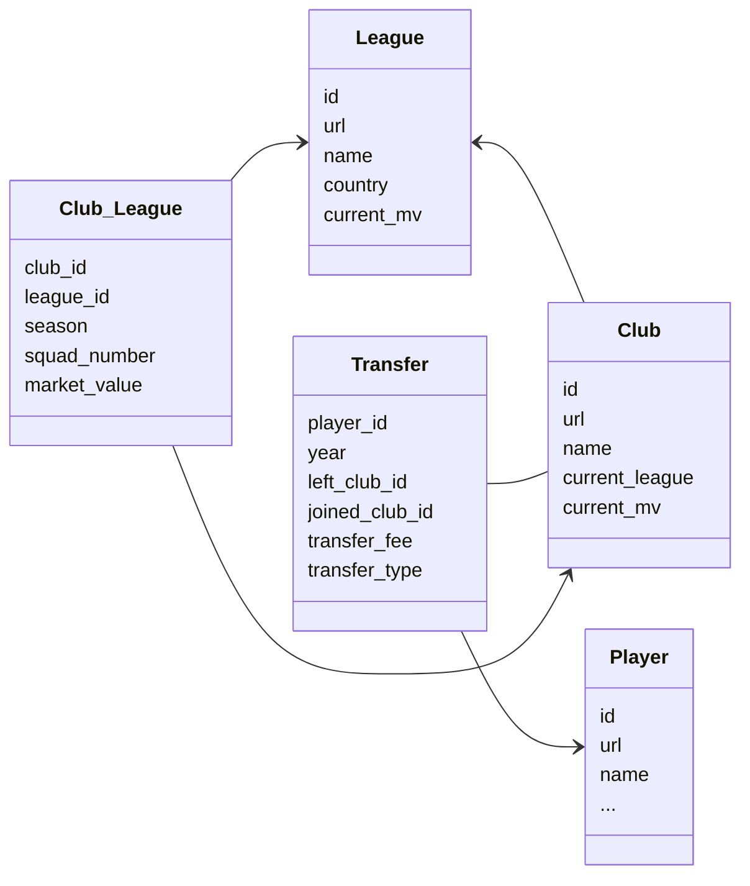

# Soccer transfers scraper

An application tha uses [scrapy](https://scrapy.org/) framework to collect data from [Transfermarkt](https://www.transfermarkt.com/) website.

The main focus of this project is to collect and store data from every transfer that is available in the website.
 - To keep things related, we also collect data from players, clubs and leagues page. 
 - All the data collected is cleaned and exported in two formats ([json-lines](https://jsonlines.org/) and csv) and aslo stored into a [mySql](https://www.mysql.com/) database.
 

------

------

## Installation

The project can be runned either locally or via [docker](https://www.docker.com/) container.

To run locally install the dependencies listed in [requirements.txt](/requirements.txt) and it is necessary to have a mysql-server instance running at default port: `3306`. 

```console
pip3 install requirements.txt
```

### Docker
```console
docker compose up
```


```console
docker exec -ti <container-id> bash
```


```console
cd tfmkt_scraper/tfmkt_scraper/

```
Spiders crawl independently, collects the data and sends through the item pipeline where the data is properly treated.

There are 5 different spiders that can be seen by running the scrapy command `scrapy list` :
  1. transferspider
  2. playerspider
  3. clubspider
  4. leaguespider
  5. club_leaguespider

You can start scraping by typing the command:
```console
scrapy crawl <spidername>

```