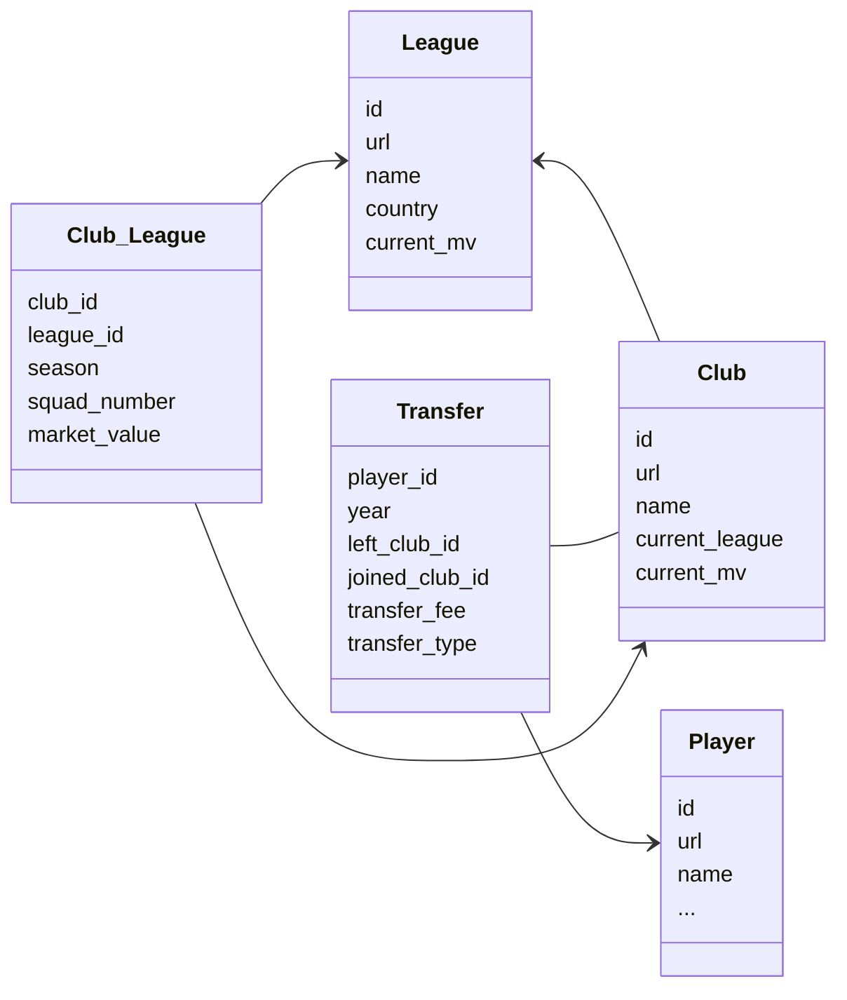

# :soccer: Soccer transfers scraper

An application that uses [scrapy](https://scrapy.org/) framework to collect data from [Transfermarkt](https://www.transfermarkt.com/) website.

The main focus of this project is to collect and store data from every transfer available in the website.

- To keep things related, we also collect data from players, clubs and leagues.
- All the data collected is cleaned and exported in two formats ([json-lines](https://jsonlines.org/) and csv) and also stored into a [mySql](https://www.mysql.com/) database.

---



---

### Docker

This project can be easily run via [Docker](https://www.docker.com/).

```console
##The scraper will automatically run using all five spiders.
docker compose up
```


If you don't want to collect data from all spiders, you can choose which one to run.

```console
## First start mysql database container
docker compose up -d mysql_db
```
Next select which spider you'd like to run
```console
## If arguments are omitted, it will run every spider.
docker compose run scrapy
```

There are 5 different spiders:

1. clubs
2. leagues
3. club_league
4. transfers
5. players

You can choose which spider will run by providing its name as an argument:

```console
##It will run only the transfers and clubs spiders.
docker compose run scrapy transfers clubs
```

### Get the scraped data
The scraped data is stored in a volume on the Docker host, and you can retrieve it using the following command:
```console
docker cp CONTAINER:/usr/src/app/tfmkt_scraper/tfmkt_scraper/data/ /destination/path/
```