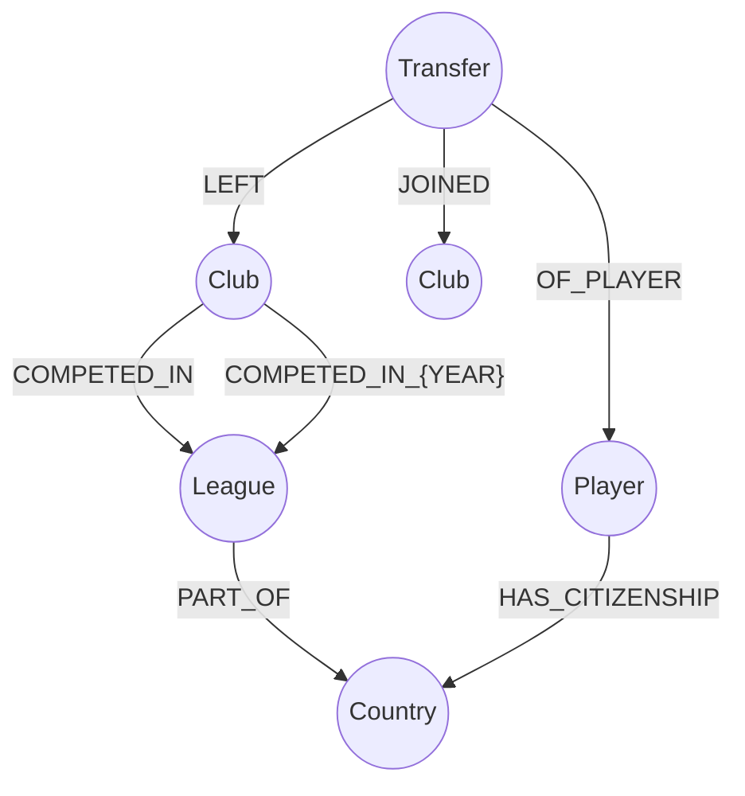
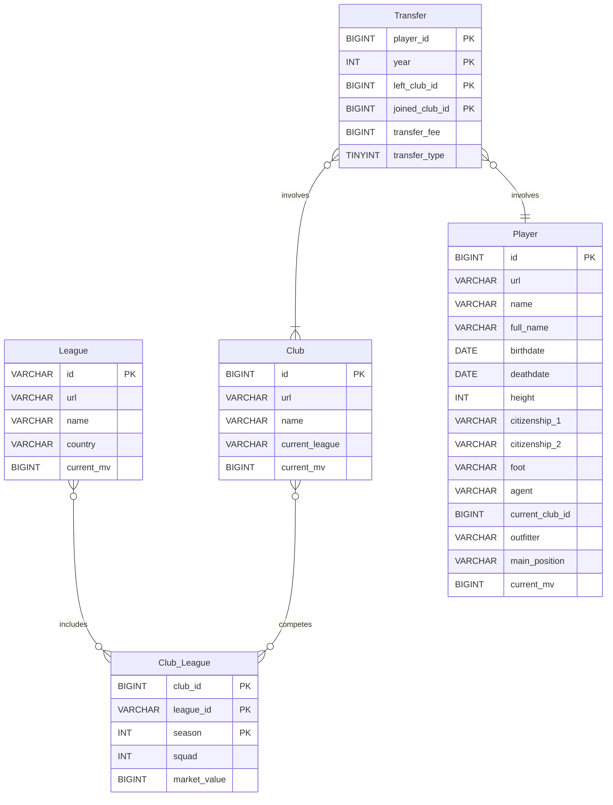

# :soccer: Transfermarkt Scraper

<p align="center">
  
</p>

An application that uses [Scrapy](https://scrapy.org/) framework to collect data from [Transfermarkt](https://www.transfermarkt.com/) website.

The main focus of this project is to collect and store data from every **transfer** available in the website.

To keep things related, we also collect data from players, clubs and leagues.
All the data collected is cleaned and exported in several formats:

- File formats:
  - [JSON-lines](https://jsonlines.org/)
  - CSV
- Databases:
  - [Neo4j](https://neo4j.com) graph database
  - [MySql](https://www.mysql.com/) relational database

---

## Neo4j Graph Data Model


This graph data model enables the tracking of player movements between clubs, the leagues and countries they are associated with, and the citizenship of the players.

> The specialized relationship `COMPETED_IN_{YEAR}` is meant to reduce the number of nodes that need to be retrieved and therefore improving query performance.

---

## MySQL Relational Data Model


---

> :warning: A `USER AGENT` must be set in order to run this project :warning:
    - Add `USER_AGENT = '<your user agent>'` to [settings.py](/tfmkt_scraper//tfmkt_scraper/settings.py)
### Installation - Docker

This project can be easily built via [Docker](https://www.docker.com/).

#### 1. Instantiate the Databases

```console
docker compose up -d neo4j
docker compose up -d mysql_db
```

Ensure both containers are running by using `docker container ps` to check their status.

> Databases can take a while to get ready. Check their connection before starting the crawler, or just wait a little.
#### 2. Run Scrapy container

```console
docker compose run -d scrapy
// If arguments are omitted, it will run every spider sequentially.
```

Done! Now you just need to wait for the data to be collected. Once every spider has finished, the container will terminate

> Tip: Omit the -d flag if you want to display the output in the terminal.

There are 5 different spiders:

1. club_league
2. clubs
3. leagues
4. players
5. transfers

You can choose which spiders to run by providing their names as arguments:

```console
docker compose run scrapy -s transfers clubs
//It will run only the transfers and clubs spiders.
```

### Access the data

#### JSON & CSV

The scraped data is stored in a volume on the Docker host. You can retrieve it using the following command:

```console
// Get JSONl and CSV files
docker cp <CONTAINER_ID>:/usr/src/app/tfmkt_scraper/tfmkt_scraper/data/ /destination/path/
```

#### Neo4j

Neo4j provides a web interface to manage the database, which can be accessed via: http://localhost:7474

- user: `neo4j`
- password: `secretgraph`

#### MySQL

The MySQL container exposes port `3307`, which can be connected to directly via `localhost`.

- user: `user`
- password: `user`

> It's recomended [MySQL Workbench](https://dev.mysql.com/downloads/workbench/) for a graphical interface
